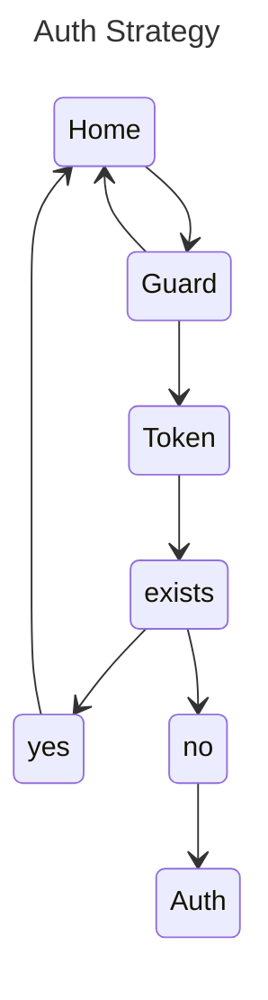
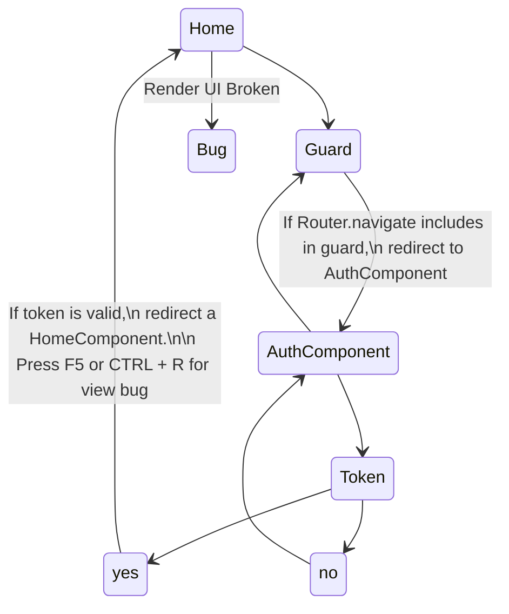

# BugGuardsV17

## When F5 or CTRL + R (Or in reload page in route /home) navigate for authComponent

This project was generated with [Angular CLI](https://github.com/angular/angular-cli) version 17.0.9.

## CLI

```zsh
Angular CLI: 17.2.0
Node: 20.10.0
Package Manager: pnpm 8.13.1
OS: linux x64

Angular: 17.2.1
... animations, common, compiler, compiler-cli, core, forms
... platform-browser, platform-browser-dynamic, platform-server
... router

Package                         Version
---------------------------------------------------------
@angular-devkit/architect       0.1700.9
@angular-devkit/build-angular   17.2.0
@angular-devkit/core            17.0.9
@angular-devkit/schematics      17.0.9
@angular/cli                    17.2.0
@angular/ssr                    17.2.0
@schematics/angular             17.0.9
rxjs                            7.8.1
typescript                      5.2.2
zone.js                         0.14.4
```

## Bug Description

### Components

The components that make up the bug reproduction are similar to those in the development project. The minimalistic reproduction has the following components: `
AppComponent,
HomeComponent,
NavbarComponent,
AuthComponent. `

if token is valid and Router.navigate(['/auth']) is present in guard, occurs navigation for auth until the observable is resolved. After new navigate to homeComponent.

### Objective



### Running


